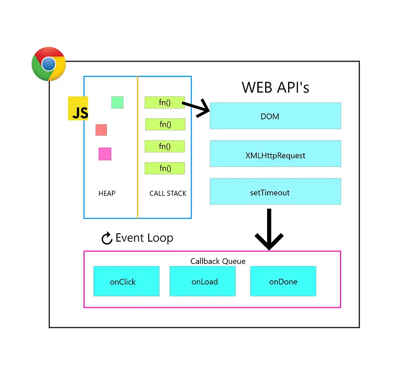

# Advance JavaScript

## What is Programming Language ?
A programming language is a means of communicating with a computer. It is a language that developers use to create specific instructions for computers.These languages ​​tell the computer how to process data, perform calculations, or how to produce output.

## what is JavaScript?
JavaScript is a high-level programming language commonly used in web browsers and web pages. It is a **scripting language** used to create dynamic content, such as interactive forms, real-time updates, and animations.It is a client-side scripting language but is now also used for server-side (Node.js) work.

---

## Behavior of JavaScript
JavaScript is a **single-threaded** language, meaning it can execute only one line of code at a time. But with the help of **asynchronous** Web APIs and Event loops, it can execute more than one **asynchronous** task simultaneously. 

---

## JavaScript Execution Workflow
JavaScript একটি **interpreted language**, অর্থাৎ এটি ব্রাউজারে সরাসরি রান হয়। এটি:
- **Object-Oriented**: বিভিন্ন অবজেক্ট তৈরি করে কাজ করা যায়।
- **Event-Driven**: ইভেন্ট যেমন ক্লিক, স্ক্রোল ইত্যাদির জন্য রেসপন্স দেয়।
- **Cross-Platform**: যে কোনো ব্রাউজারে কাজ করে।
- **Lightweight**: সহজ ও দ্রুত।

---

## প্রোজেক্টের স্ক্রিনশট
নীচে প্রোজেক্টের একটি স্ক্রিনশট দেওয়া হলো:

