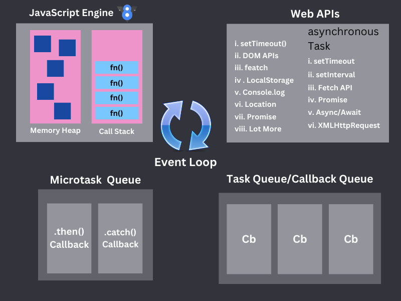

# Advance JavaScript

## What is Programming Language ?
A programming language is a means of communicating with a computer. It is a language that developers use to create specific instructions for computers.These languages ​​tell the computer how to process data, perform calculations, or how to produce output.

## what is JavaScript?
JavaScript is a high-level programming language commonly used in web browsers and web pages. It is a **scripting language** used to create dynamic content, such as interactive forms, real-time updates, and animations.It is a client-side scripting language but is now also used for server-side (Node.js) work.

---

## Behavior of JavaScript
JavaScript is a **single-threaded** language, meaning it can execute only one line of code at a time. But with the help of **asynchronous** Web APIs and Event loops, it can execute more than one **asynchronous** task simultaneously. 

---

# JavaScript Execution Workflow

## 1. JavaScript Engine
- **I. Call Stack**: Here all **synchronous** tasks are executed one after the other.
- **II.Memory Heap**: Data is stored here (like variables, objects, etc.).
## 2. Web APIs
- **I. Asynchronous** tasks (such as setTimeout, fetch, DOM events) are handled by the browser or Node.js' **Web APIs**.
## 3. Task Queue (Callback Queue)
- **I.** When Web APIs complete a task, send the **callback** for that task here.
## 4. Microtask Queue
- **I.** This **Queue** is used for **.then()** or **.catch()** of Promise or Fetch API.
- **II. Microtask Queue** always has higher priority than **Task Queue.**
## 5. Event Loop
- **I.** The **Event Loop** constantly checks, if the **Call Stack** is empty, moves the task from the **Task Queue** or **Microtask Queue** to the Call Stack and executes it.

## 📬 Contact Me
- **Email**: [mabdulkadir5g@gmail](mailto:mabdulkadir5g@gmail.com)  
- **Facebook**: [AbdulKadir](https://www.facebook.com/abdul.kadir.320045/)  
- **Website**: [mdabdulkadir.com](https://mdabdulkadir.com)  
- **GitHub**: [AbdulKadir0007](https://github.com/AbdulKadir0007)  

---

## 🌐 Let's Connect!  
Feel free to reach out if you'd like to collaborate or learn more about my work. 

